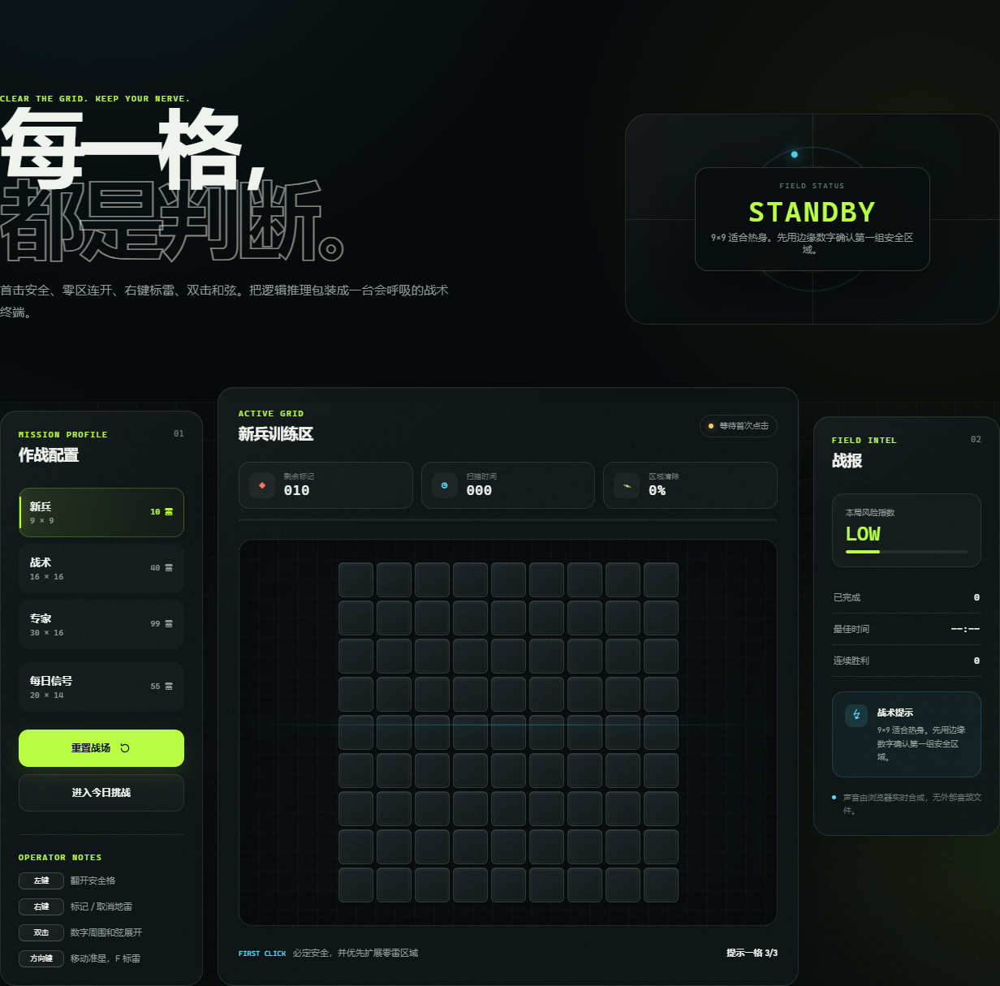
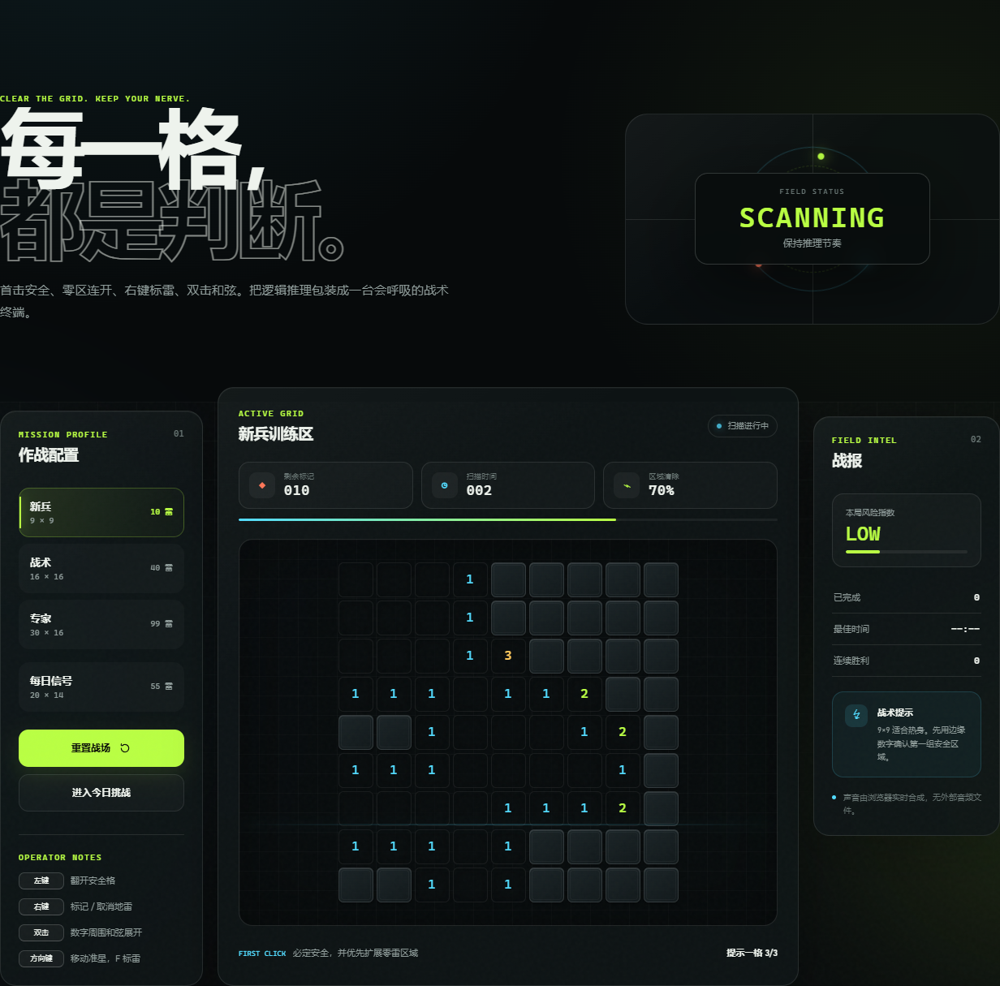
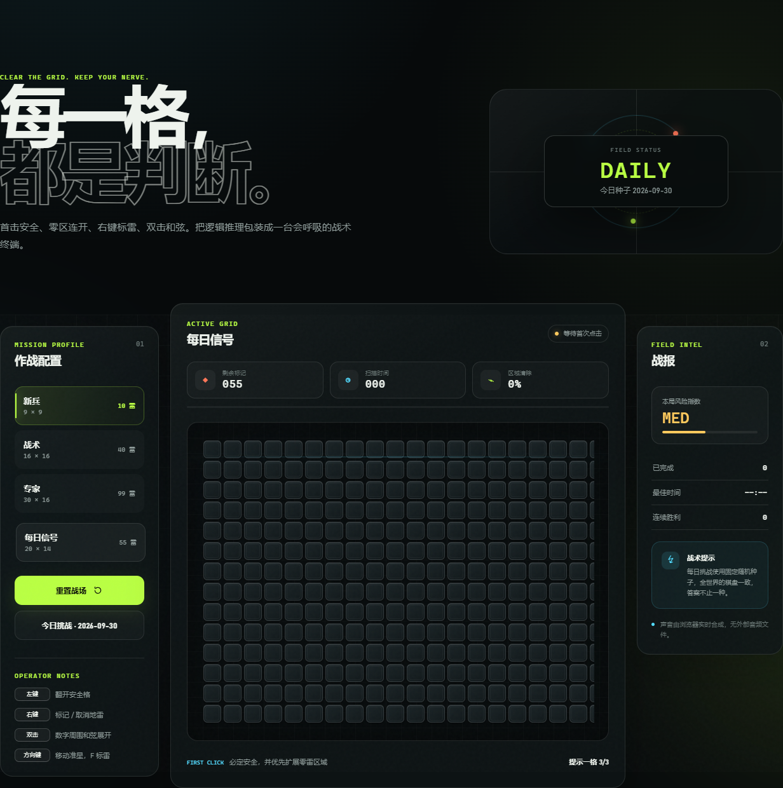

# MINE//FIELD · 现代战术扫雷

> **CLEAR THE GRID. KEEP YOUR NERVE.**
>
> 把经典扫雷装进一台会呼吸的战术终端：先观察数字，再锁定安全区，最后在压力下清空整张棋盘。

<p align="center">
  <a href="https://minefield-tactical-sweeper.vercel.app/"><strong>▶ 在线试玩</strong></a>
  ·
  <a href="#玩法">玩法说明</a>
  ·
  <a href="#本地运行">本地运行</a>
</p>



## 项目简介

MINE//FIELD 是一个零构建、纯前端的战术扫雷小游戏。界面采用深色终端风格，把棋盘、风险指数、扫描时间和区域清除进度放在同一个作战面板里；游戏逻辑仍然遵循经典扫雷的确定性推理，但操作手感更适合键盘、鼠标和触屏。

## 玩法

每个数字表示它周围八格中地雷的数量。用数字推断安全格与雷区，清空所有安全格即可完成任务。

| 操作 | 用途 |
| --- | --- |
| 左键 / `Enter` / `Space` | 翻开一格；首击必定安全 |
| 右键 / `F` | 标记或取消地雷 |
| 双击 / `X` | 对数字执行和弦展开：旗帜数量正确时批量翻开周围格 |
| 方向键 | 移动键盘准星，适合不碰鼠标完成一局 |
| 触屏长按 | 标记地雷 |

### 一局的节奏

1. **先开零区**：首击会避开地雷，并优先扩展相邻的零雷区域。
2. **读数字**：从边缘和已知数字开始，逐步排除不可能的位置。
3. **挂旗确认**：确定是雷的格子先标记，再用旗帜数量辅助和弦展开。
4. **控制风险**：右侧战报会显示风险指数、清除进度、最佳时间和连胜记录。




## 四种作战配置

| 模式 | 棋盘 | 地雷 | 适合谁 |
| --- | ---: | ---: | --- |
| 新兵 | 9 × 9 | 10 | 熟悉规则、热身 |
| 战术 | 16 × 16 | 40 | 练习区域推理 |
| 专家 | 30 × 16 | 99 | 挑战高密度信息与横向滚动 |
| 每日信号 | 20 × 14 | 55 | 每天一张固定种子棋盘，与朋友比较路线 |

每日信号使用当天日期生成固定种子；同一天进入的玩家会面对同一张棋盘，但可以找到不同的解题路径。



## 主要特性

- 首击安全，零雷区域自动连开
- 新兵、战术、专家三档难度，加上每日固定种子挑战
- 本地保存最佳时间、完成局数和连续胜利
- 实时合成音效，不依赖外部音频文件
- 键盘、鼠标、触屏均可操作
- 支持 `prefers-reduced-motion`，并为专家棋盘提供横向滚动
- 响应式布局，桌面端与移动端都能直接游玩

## 技术实现

- **HTML**：语义化布局、ARIA 棋盘与键盘可访问性
- **CSS**：响应式三栏控制台、扫描线、状态灯和终端视觉效果
- **JavaScript**：可复现随机布雷、零区 flood fill、和弦展开、计时器、本地统计与 Web Audio 音效
- **部署**：静态文件，可直接放到 Vercel、GitHub Pages、Netlify 等托管平台

## 本地运行

无需安装依赖，直接打开 `index.html` 即可开始游戏。也可以在仓库根目录启动任意静态服务器：

```powershell
npx serve .
```

然后访问终端输出的本地地址。

## 部署

仓库已包含 `vercel.json`。在 Vercel 中导入仓库后保持默认设置即可：无需构建命令，输出目录就是仓库根目录。

## 项目结构

```text
├── index.html       # 页面结构与可访问性标记
├── styles.css       # 终端风格与响应式布局
├── app.js           # 扫雷规则、交互、统计与音效
├── favicon.svg      # 网站图标
├── vercel.json      # 静态部署配置
└── docs/images/     # README 展示截图
```

## License

当前仓库未单独声明开源许可证；如需二次分发，请先与作者确认授权范围。
